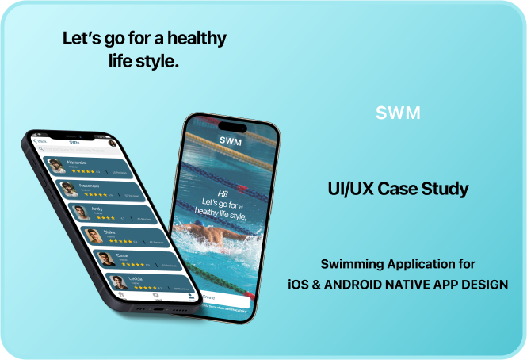

## Portfolio

---
[Instacart - Shopping App](https://www.behance.net/gallery/189225007/Shopping-App)

 This e-commerce mobile application provides users with a seamless online shopping experience, allowing them to purchase a wide range of products from anywhere. Our platform is designed to offer effortless navigation through diverse collections, saving users time and effort. Enjoy the convenience of discovering and selecting your desired products with ease, making your online shopping journey enjoyable and efficient. 

 
  
 

---
[Cooking App](https://www.behance.net/gallery/188944747/Recipe-App-Case-study)

 The food recipe app is designed to offer a wide variety of recipes to users, providing quick and easy guidance through step-by-step interactions accompanied by images. 
Additionally, the app includes clear and informative recipe videos, complete with time-based management. Users can save their favourite recipes on a weekly calendar for convenient meal planning. 

 
   

---
[Swimming App](https://www.behance.net/gallery/189227747/Swimming-App)

 SWM is a mobile app. During my CareerFoundry Bootcamp, I developed an app aimed at simplifying the process of finding swimming classes and trainers for users. The application offers real-time information on swimming-related activities. I took charge of designing every aspect to ensure a user-friendly experience, making it easy for everyone to locate and book swimming classes and trainers. 

 
   

---
[Re-Selling App](https://www.behance.net/gallery/188951419/Re-Selling-App)

The reselling app features product listings displaying images, descriptions, and prices, while offering users the ability to browse, search, and contact sellers. Additionally, users can search for similar products based on nearby locations. 

 
 

<!DOCTYPE html>
<html lang="en">
<head>
    <meta charset="UTF-8">
    <meta name="viewport" content="width=device-width, initial-scale=1.0">
    <title>My Portfolio</title>
    <link rel="stylesheet" href="styles.css">
</head>
<body>
    <header>
        <h1>My Portfolio</h1>
        <nav>
            <ul>
                <li><a href="#about">About</a></li>
                <li><a href="#projects">Projects</a></li>
                <li><a href="#contact">Contact</a></li>
            </ul>
        </nav>
    </header>
    <section id="about">
        <h2>About Me</h2>
        
Welcome to my portfolio! I am a beginner web developer eager to showcase my skills.

    </section>
    <section id="projects">
        <h2>Projects</h2>
     [Instacart - Shopping App](https://www.behance.net/gallery/189225007/Shopping-App)

 This e-commerce mobile application provides users with a seamless online shopping experience, allowing them to purchase a wide range of products from anywhere. Our platform is designed to offer effortless navigation through diverse collections, saving users time and effort. Enjoy the convenience of discovering and selecting your desired products with ease, making your online shopping journey enjoyable and efficient. 

 
  
        

            <h3>Project 1</h3>
            
Description of Project 1.

        

        

            <h3>Project 2</h3>
            
Description of Project 2.

        

    </section>
    <section id="contact">
        <h2>Contact Me</h2>
        
You can reach me at example@example.com

    </section>
</body>
</html>
 
 
 
 
 
 
 
 
 
 
 
 
 
 
 
 
 
 
 CSS (styles.css):

css
Copy code
body {
    font-family: Arial, sans-serif;
    margin: 0;
    padding: 0;
}

header {
    background-color: #333;
    color: #fff;
    padding: 20px;
}

nav ul {
    list-style-type: none;
    margin: 0;
    padding: 0;
}

nav ul li {
    display: inline;
    margin-right: 20px;
}

nav ul li a {
    color: #fff;
    text-decoration: none;
}

section {
    padding: 20px;
}

section h2 {
    color: #333;
}

.project {
    margin-bottom: 20px;
}

 
   
 
 
 
 ---
